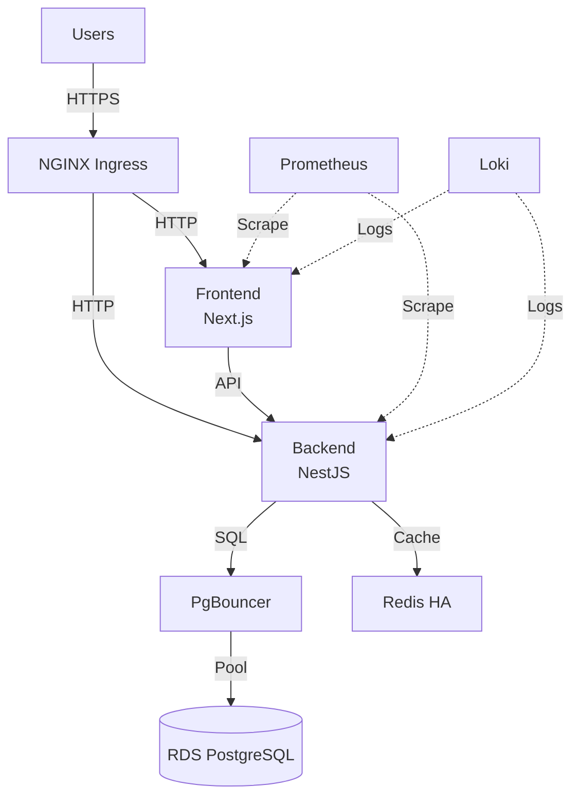

# Kubernetes Deployment Documentation

Welcome to the Hospital ERP System Kubernetes deployment documentation. This directory contains comprehensive guides for deploying and operating the system on Kubernetes.

## Quick Start

### For Developers (Local Development)

```bash
# 1. Start local Kubernetes cluster
kind create cluster --name hospital-erp

# 2. Deploy to development environment
kubectl apply -k k8s/overlays/development

# 3. Wait for pods to be ready
kubectl wait --for=condition=ready pod -l app.kubernetes.io/part-of=hospital-erp-system -n hospital-erp-system --timeout=5m

# 4. Port-forward to access locally
kubectl port-forward -n hospital-erp-system svc/frontend-service 3001:3001
kubectl port-forward -n hospital-erp-system svc/backend-service 3000:3000

# Access at http://localhost:3001
```

### For Production Deployment

```bash
# 1. Create EKS cluster (one-time setup)
eksctl create cluster -f k8s/cluster-config.yaml

# 2. Install core infrastructure (one-time setup)
./scripts/setup-infrastructure.sh

# 3. Deploy application
kubectl apply -k k8s/overlays/production

# 4. Verify deployment
kubectl get pods -n hospital-erp-system
kubectl get ingress -n hospital-erp-system
```

See [deployment-guide.md](deployment-guide.md) for detailed instructions.

## Documentation Structure

| Document                                         | Description                                       |
| ------------------------------------------------ | ------------------------------------------------- |
| **README.md** (this file)                        | Overview and quick start guide                    |
| **[architecture.md](architecture.md)**           | System architecture, components, and design       |
| **[deployment-guide.md](deployment-guide.md)**   | Step-by-step deployment instructions              |
| **[configuration.md](configuration.md)**         | Configuration reference and environment variables |
| **[security.md](security.md)**                   | Security documentation and best practices         |
| **[disaster-recovery.md](disaster-recovery.md)** | Backup and recovery procedures                    |
| **[troubleshooting.md](troubleshooting.md)**     | Common issues and solutions                       |
| **[runbooks/](runbooks/)**                       | Operational runbooks for incident response        |

## Architecture Overview



For detailed architecture, see [architecture.md](architecture.md).

## Prerequisites

### Required Tools

- **kubectl** (1.28+): Kubernetes CLI
- **kustomize** (5.0+): Configuration management
- **helm** (3.12+): Package manager for Kubernetes
- **AWS CLI** (2.x): For EKS and AWS resources (production only)

### AWS Resources (Production Only)

- RDS PostgreSQL instance (15+)
- AWS Secrets Manager for credentials
- S3 bucket for backups (optional)
- IAM roles for EKS and External Secrets

### Cluster Requirements

| Environment | Nodes | vCPU | Memory | Storage |
| ----------- | ----- | ---- | ------ | ------- |
| Development | 1-2   | 2-4  | 4-8 GB | 50 GB   |
| Staging     | 3     | 12   | 24 GB  | 100 GB  |
| Production  | 3+    | 16+  | 32 GB+ | 200 GB+ |

## Common Commands

### Deployment

```bash
# Deploy to environment
kubectl apply -k k8s/overlays/development
kubectl apply -k k8s/overlays/staging
kubectl apply -k k8s/overlays/production

# Preview changes before applying
kubectl kustomize k8s/overlays/production

# Update deployment (rolling update)
kubectl rollout restart deployment/backend -n hospital-erp-system
kubectl rollout restart deployment/frontend -n hospital-erp-system

# Check rollout status
kubectl rollout status deployment/backend -n hospital-erp-system
```

### Monitoring

```bash
# Check pod status
kubectl get pods -n hospital-erp-system

# View pod logs
kubectl logs -n hospital-erp-system deployment/backend --tail=100 --follow
kubectl logs -n hospital-erp-system deployment/frontend --tail=100 --follow

# Check resource usage
kubectl top pods -n hospital-erp-system
kubectl top nodes

# Describe pod for events and details
kubectl describe pod <POD_NAME> -n hospital-erp-system
```

### Debugging

```bash
# Execute command in pod
kubectl exec -n hospital-erp-system deployment/backend -it -- /bin/sh

# Port forward to local machine
kubectl port-forward -n hospital-erp-system svc/backend-service 3000:3000

# Test internal service connectivity
kubectl run test-pod --image=curlimages/curl --rm -it --restart=Never -- \
  curl http://backend-service.hospital-erp-system.svc.cluster.local:3000/health

# Get all resources in namespace
kubectl get all -n hospital-erp-system
```

### Secrets and ConfigMaps

```bash
# View ConfigMaps
kubectl get configmaps -n hospital-erp-system
kubectl describe configmap backend-config -n hospital-erp-system

# View Secrets (values are base64 encoded)
kubectl get secrets -n hospital-erp-system
kubectl describe secret database-credentials -n hospital-erp-system

# Edit ConfigMap
kubectl edit configmap backend-config -n hospital-erp-system

# Verify External Secrets sync status
kubectl get externalsecrets -n hospital-erp-system
```

### Scaling

```bash
# Manual scaling
kubectl scale deployment/backend --replicas=5 -n hospital-erp-system

# Check HPA (HorizontalPodAutoscaler) status
kubectl get hpa -n hospital-erp-system
kubectl describe hpa backend-hpa -n hospital-erp-system

# View pod distribution across nodes
kubectl get pods -n hospital-erp-system -o wide
```

### Rollback

```bash
# View rollout history
kubectl rollout history deployment/backend -n hospital-erp-system

# Rollback to previous version
kubectl rollout undo deployment/backend -n hospital-erp-system

# Rollback to specific revision
kubectl rollout undo deployment/backend -n hospital-erp-system --to-revision=3
```

## Environment-Specific Configuration

### Development

- **Purpose**: Local development and testing
- **Replicas**: 1 per service
- **Resources**: Minimal (512Mi memory, 500m CPU max)
- **Logging**: Debug level
- **Ingress**: Not required (use port-forward)

### Staging

- **Purpose**: Pre-production testing
- **Replicas**: 2 per service
- **Resources**: Production-like
- **Logging**: Info level
- **Ingress**: staging.hospital-erp.example.com

### Production

- **Purpose**: Live user traffic
- **Replicas**: 3+ per service (with autoscaling)
- **Resources**: Full allocation
- **Logging**: Warn/error level
- **Ingress**: hospital-erp.example.com

## Monitoring and Observability

### Prometheus Metrics

```bash
# Port-forward to Prometheus UI
kubectl port-forward -n monitoring svc/prometheus-kube-prometheus-prometheus 9090:9090

# Open http://localhost:9090
# Example queries:
# - CPU usage: rate(container_cpu_usage_seconds_total[5m])
# - Memory usage: container_memory_working_set_bytes
# - Request rate: rate(http_requests_total[5m])
```

### Grafana Dashboards

```bash
# Port-forward to Grafana UI
kubectl port-forward -n monitoring svc/prometheus-grafana 3000:80

# Open http://localhost:3000
# Default login: admin / CHANGE_ME_ADMIN_PASSWORD
# Available dashboards:
# - Kubernetes / Compute Resources / Namespace (Pods)
# - Application Overview (custom)
# - Database Performance (custom)
```

### Loki Logs

```bash
# Port-forward to Loki
kubectl port-forward -n monitoring svc/loki 3100:3100

# Query logs via LogQL
curl -G -s "http://localhost:3100/loki/api/v1/query_range" \
  --data-urlencode 'query={namespace="hospital-erp-system", app="backend"}' \
  --data-urlencode 'limit=100' | jq .
```

## Alerting

Alerts are configured for:

- **High error rate** (>5% for 5 minutes)
- **High response time** (P95 > 500ms for 5 minutes)
- **Pod crash looping**
- **High CPU/memory usage** (>90% for 10 minutes)
- **Database connection failures**

Alert destinations:

- **Critical alerts** → PagerDuty (24/7 on-call)
- **Warning alerts** → Slack (#hospital-erp-alerts)
- **Info alerts** → Email

See [runbooks/](runbooks/) for alert response procedures.

## GitOps with ArgoCD

### Access ArgoCD UI

```bash
# Get initial admin password
kubectl -n argocd get secret argocd-initial-admin-secret -o jsonpath="{.data.password}" | base64 -d; echo

# Port-forward to ArgoCD UI
kubectl port-forward -n argocd svc/argocd-server 8080:443

# Open https://localhost:8080
# Login: admin / <password-from-above>
```

### Deploy via ArgoCD

```bash
# Create application
argocd app create hospital-erp-production \
  --repo https://github.com/kcenon/hospital_erp_system.git \
  --path k8s/overlays/production \
  --dest-server https://kubernetes.default.svc \
  --dest-namespace hospital-erp-system

# Sync application
argocd app sync hospital-erp-production

# Check application status
argocd app get hospital-erp-production
```

## Security Best Practices

### Network Policies

- Default deny-all ingress/egress
- Explicit allow rules for required traffic only
- DNS always allowed for service discovery

### Pod Security

- Run as non-root user
- Read-only root filesystem
- Drop all Linux capabilities
- Restricted securityContext enforced

### Secrets Management

- Secrets stored in AWS Secrets Manager (not in Git)
- External Secrets Operator syncs to Kubernetes
- Automatic rotation every 90 days
- Encryption at rest with KMS

See [security.md](security.md) for detailed security documentation.

## Disaster Recovery

### Backup Strategy

| Component | Method         | Frequency | Retention  |
| --------- | -------------- | --------- | ---------- |
| Database  | RDS snapshots  | Daily     | 7 days     |
| Redis     | RDB snapshots  | 5 minutes | 1 day      |
| Manifests | Git repository | On commit | Indefinite |

### Recovery Time Objectives (RTO)

| Failure Type     | RTO       | Recovery Procedure       |
| ---------------- | --------- | ------------------------ |
| Pod failure      | < 1 min   | Automatic (K8s)          |
| Node failure     | < 5 min   | Automatic (rescheduling) |
| Database failure | < 30 min  | Restore RDS snapshot     |
| Cluster failure  | < 2 hours | Rebuild + restore        |

See [disaster-recovery.md](disaster-recovery.md) for detailed procedures.

## Troubleshooting

### Common Issues

1. **Pods stuck in Pending**
   - Check node resources: `kubectl top nodes`
   - Check PVC status: `kubectl get pvc -n hospital-erp-system`

2. **CrashLoopBackOff**
   - Check logs: `kubectl logs <pod> -n hospital-erp-system --previous`
   - Check secrets: `kubectl get secrets -n hospital-erp-system`

3. **502/503 errors**
   - Check backend pods: `kubectl get pods -n hospital-erp-system`
   - Check service endpoints: `kubectl get endpoints -n hospital-erp-system`

4. **TLS certificate not issued**
   - Check DNS: `nslookup www.hospital-erp.example.com`
   - Check cert-manager logs: `kubectl logs -n cert-manager deployment/cert-manager`

See [troubleshooting.md](troubleshooting.md) for comprehensive troubleshooting guide.

## Operational Runbooks

For incident response and operational procedures, see:

- [High Error Rate](runbooks/high-error-rate.md)
- [High Response Time](runbooks/high-response-time.md)
- [Pod Crash Looping](runbooks/pod-crash-looping.md)
- [Database Connection Issues](runbooks/database-connection-issues.md)
- [Scaling Procedures](runbooks/scaling-procedures.md)
- [Incident Response](runbooks/incident-response.md)

## Support and Resources

### Internal Resources

- **Slack Channels**:
  - `#hospital-erp-devops` - DevOps team
  - `#hospital-erp-alerts` - Automated alerts
  - `#hospital-erp-oncall` - On-call escalation

- **GitHub**:
  - [Issues](https://github.com/kcenon/hospital_erp_system/issues)
  - [Pull Requests](https://github.com/kcenon/hospital_erp_system/pulls)

### External Documentation

- [Kubernetes Documentation](https://kubernetes.io/docs/)
- [Kustomize Documentation](https://kustomize.io/)
- [NGINX Ingress Controller](https://kubernetes.github.io/ingress-nginx/)
- [ArgoCD Documentation](https://argo-cd.readthedocs.io/)
- [Prometheus Operator](https://prometheus-operator.dev/)
- [AWS EKS Best Practices](https://aws.github.io/aws-eks-best-practices/)

## Contributing

When updating Kubernetes manifests:

1. Make changes in the appropriate directory (`k8s/base/` or `k8s/overlays/`)
2. Test changes in development environment first
3. Preview changes: `kubectl kustomize k8s/overlays/production`
4. Create PR with detailed description
5. Deploy to staging for validation
6. Deploy to production after approval

## License

This project is licensed under the MIT License - see the [LICENSE](../../LICENSE) file for details.

## Version History

| Version | Date       | Changes                                     |
| ------- | ---------- | ------------------------------------------- |
| 1.0.0   | 2026-01-24 | Initial Kubernetes deployment documentation |

---

For detailed deployment procedures, start with [deployment-guide.md](deployment-guide.md).
