# Kubernetes Architecture

## Overview

The Hospital ERP System uses a production-grade Kubernetes architecture designed for high availability, scalability, and security. The system follows cloud-native best practices with GitOps deployment, comprehensive observability, and zero-trust networking.

## High-Level Architecture

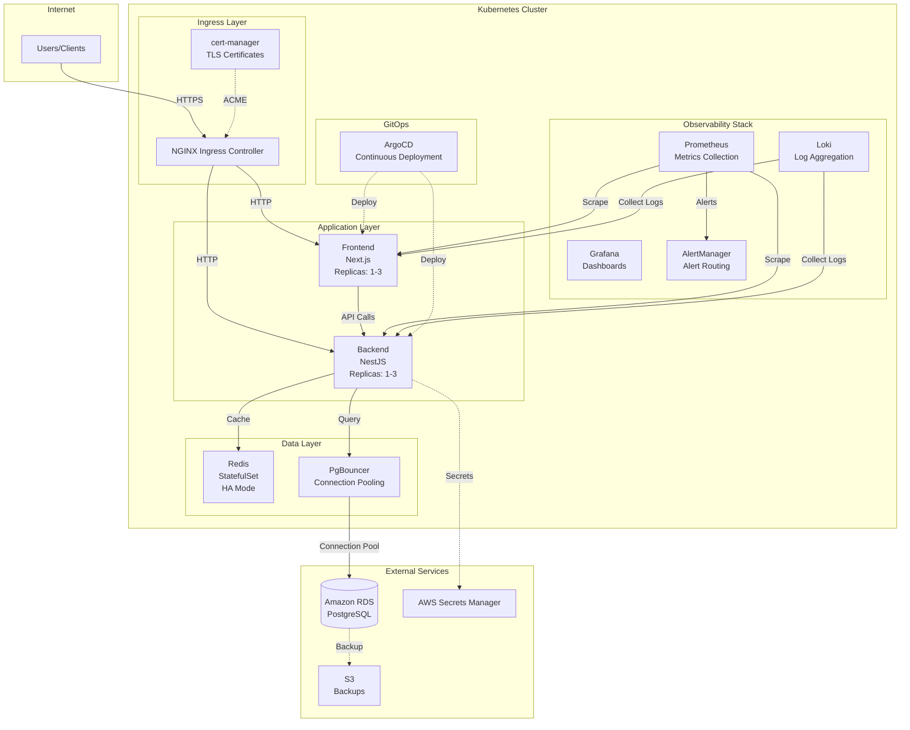

## Component Architecture

### 1. Ingress Layer

The ingress layer handles external traffic routing and TLS termination.

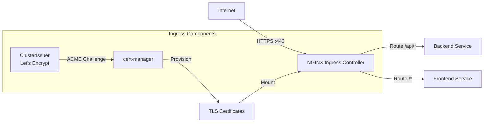

**Components:**

- **NGINX Ingress Controller**: Routes external traffic to services
- **cert-manager**: Automates TLS certificate provisioning and renewal
- **ClusterIssuer**: Configures Let's Encrypt for free TLS certificates

**Key Features:**

- Automatic HTTPS with Let's Encrypt
- Path-based routing (`/api/*` → Backend, `/*` → Frontend)
- Rate limiting and request buffering
- WebSocket support for real-time features

### 2. Application Layer

The application layer consists of frontend and backend services with autoscaling capabilities.

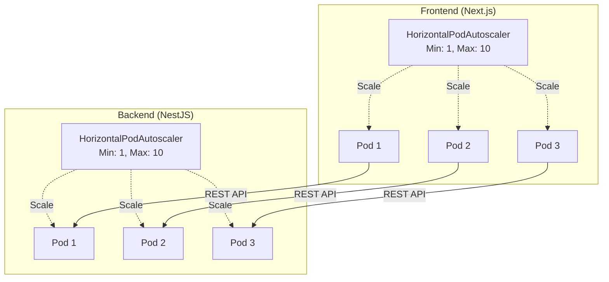

**Frontend (Next.js):**

- Server-side rendering (SSR) for optimal performance
- Static asset caching
- Replicas: 1 (dev) / 2 (staging) / 3 (production)
- Resource limits: 512Mi memory, 500m CPU

**Backend (NestJS):**

- RESTful API with TypeScript
- JWT-based authentication
- Replicas: 1 (dev) / 2 (staging) / 3 (production)
- Resource limits: 1Gi memory, 1000m CPU

**Autoscaling Triggers:**

- CPU utilization > 70%
- Memory utilization > 80%
- Custom metrics (requests per second)

### 3. Data Layer

The data layer provides caching and database connection management.

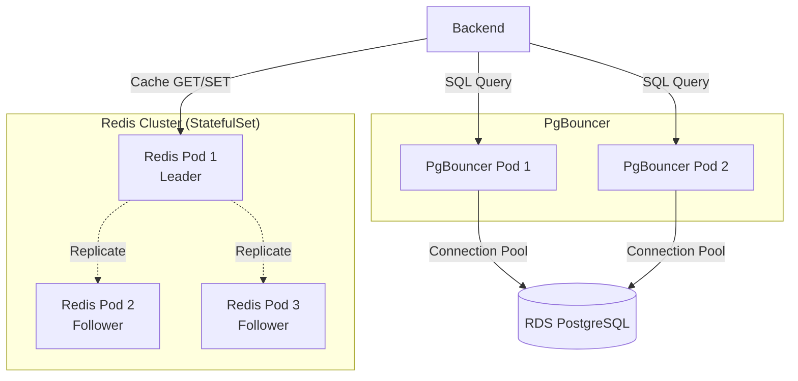

**Redis:**

- StatefulSet for persistent storage
- 3 replicas for high availability
- Used for: Session storage, API response caching, rate limiting
- Persistence: RDB snapshots + AOF logs

**PgBouncer:**

- Connection pooling to reduce database load
- Transaction-level pooling mode
- Max connections: 100 per pod
- Reduces connection overhead to RDS

**Amazon RDS PostgreSQL:**

- Managed database service (external to cluster)
- Multi-AZ deployment for failover
- Automated backups to S3
- Point-in-time recovery (PITR)

### 4. Security Architecture

The system implements defense-in-depth security with multiple layers.

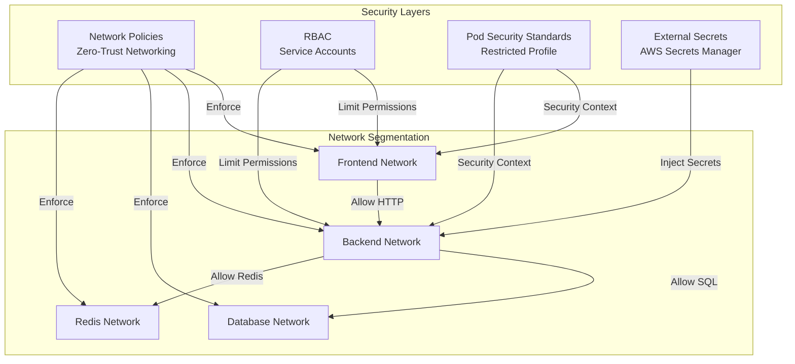

**Network Policies:**

- Default deny-all ingress/egress
- Explicit allow rules for required traffic only
- DNS always allowed for service discovery
- Frontend → Backend only
- Backend → Database, Redis only

**RBAC (Role-Based Access Control):**

- Dedicated service accounts per component
- Least-privilege principle
- Backend: Secrets read access, ConfigMap read access
- Frontend: ConfigMap read access only

**Pod Security Standards:**

- Restricted profile enforced
- `runAsNonRoot: true`
- `readOnlyRootFilesystem: true`
- `allowPrivilegeEscalation: false`
- All Linux capabilities dropped

**External Secrets:**

- Secrets stored in AWS Secrets Manager (not in Git)
- External Secrets Operator syncs secrets to Kubernetes
- Automatic rotation every 90 days
- Secrets include: DB credentials, JWT keys, API keys

### 5. Observability Stack

Comprehensive monitoring, logging, and alerting for production operations.

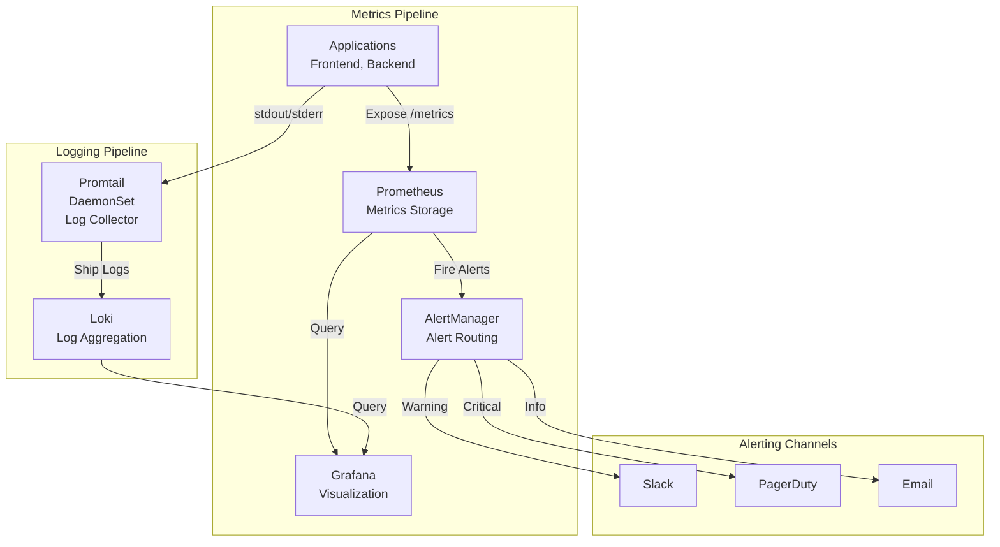

**Prometheus:**

- Scrapes metrics from all pods every 15 seconds
- Retention: 30 days
- Metrics: CPU, memory, request rate, error rate, latency

**Grafana:**

- Pre-built dashboards for: Application overview, Kubernetes cluster, Database performance
- LogQL queries for Loki logs
- Alerting visualization

**Loki:**

- Log aggregation from all pods
- Structured logging with JSON format
- Retention: 7 days
- LogQL for querying logs

**AlertManager:**

- Routes alerts based on severity
- Critical → PagerDuty (24/7 on-call)
- Warning → Slack (#hospital-erp-alerts)
- Info → Email

**Key Alerts:**

- High error rate (>5% for 5 minutes)
- High response time (P95 > 500ms for 5 minutes)
- Pod crash looping
- High CPU/memory usage (>90% for 10 minutes)

### 6. GitOps Deployment

ArgoCD manages continuous deployment with Git as the single source of truth.

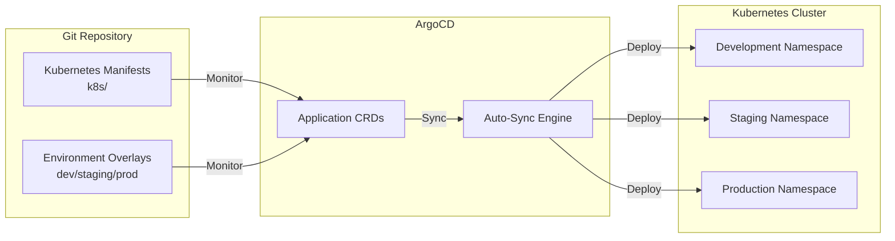

**ArgoCD Features:**

- Automatic synchronization every 3 minutes
- Git webhook triggers for faster deployment
- Rollback capability to any previous Git commit
- Health status monitoring for all resources
- Self-healing: Detects and fixes configuration drift

**Deployment Flow:**

1. Developer commits changes to `k8s/` directory
2. ArgoCD detects changes via Git polling or webhook
3. ArgoCD applies changes to target environment
4. Health checks ensure successful deployment
5. Rollback automatically if health checks fail

**Environment Progression:**

- Development → Auto-deploy on every commit
- Staging → Auto-deploy after successful dev deployment
- Production → Manual approval required (via ArgoCD UI)

## Network Topology

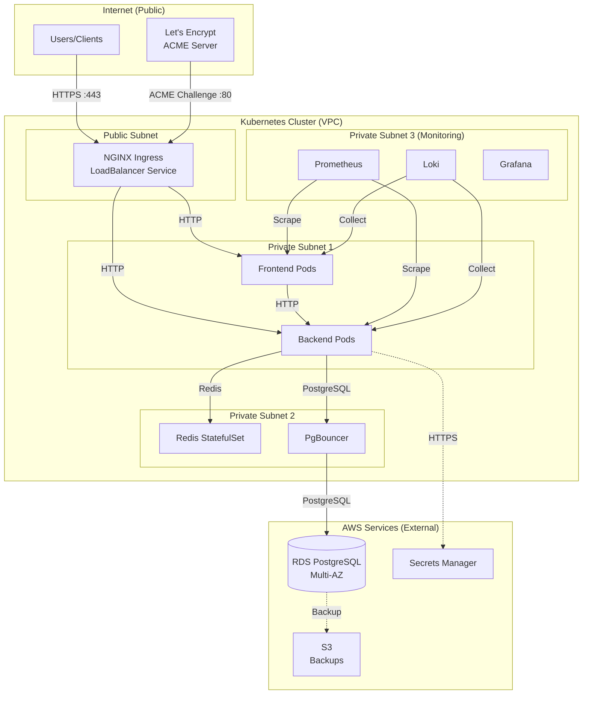

**Network Segmentation:**

- **Public Subnet**: Only ingress controller exposed to internet
- **Private Subnet 1**: Application pods (no direct internet access)
- **Private Subnet 2**: Data layer (restricted access)
- **Private Subnet 3**: Monitoring stack (internal only)

**Network Policies:**

- Default deny all traffic
- Explicit allow rules for required communication
- Egress to AWS services via VPC endpoints (no internet gateway)

## Data Flow Diagrams

### User Request Flow

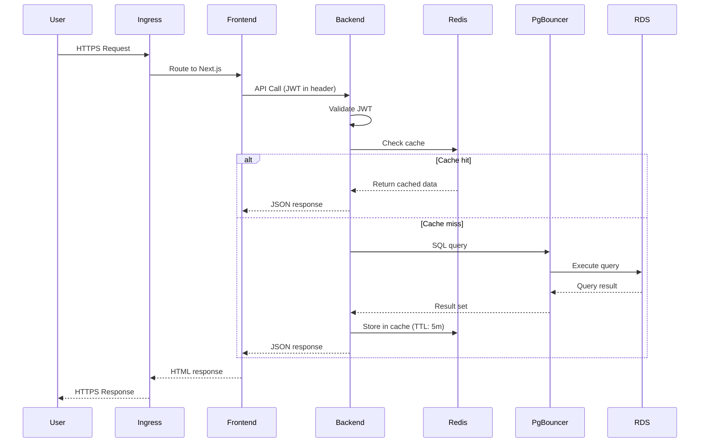

### Monitoring Data Flow

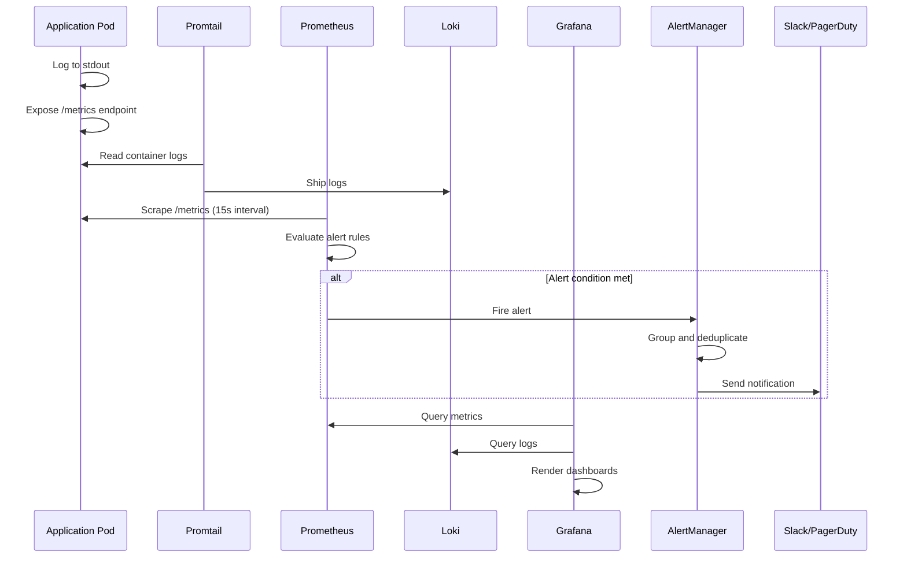

### Deployment Flow

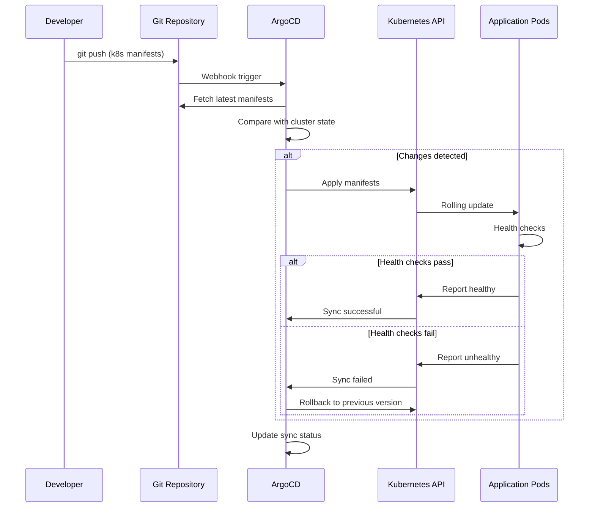

## Scalability and High Availability

### Horizontal Pod Autoscaling

| Component | Min Replicas       | Max Replicas | Target CPU | Target Memory |
| --------- | ------------------ | ------------ | ---------- | ------------- |
| Frontend  | 1 (dev) / 3 (prod) | 10           | 70%        | 80%           |
| Backend   | 1 (dev) / 3 (prod) | 10           | 70%        | 80%           |
| PgBouncer | 2                  | 5            | 60%        | -             |
| Redis     | 3 (fixed)          | 3 (fixed)    | -          | -             |

### Pod Disruption Budgets

| Component | Min Available | Max Unavailable |
| --------- | ------------- | --------------- |
| Frontend  | 50%           | -               |
| Backend   | 50%           | -               |
| Redis     | 2             | 1               |

**Purpose**: Ensures minimum availability during voluntary disruptions (node drains, cluster upgrades).

### Resource Limits and Requests

| Component | CPU Request | CPU Limit | Memory Request | Memory Limit |
| --------- | ----------- | --------- | -------------- | ------------ |
| Frontend  | 100m        | 500m      | 128Mi          | 512Mi        |
| Backend   | 250m        | 1000m     | 512Mi          | 1Gi          |
| Redis     | 100m        | 500m      | 256Mi          | 512Mi        |
| PgBouncer | 50m         | 200m      | 64Mi           | 128Mi        |

### Multi-AZ Deployment

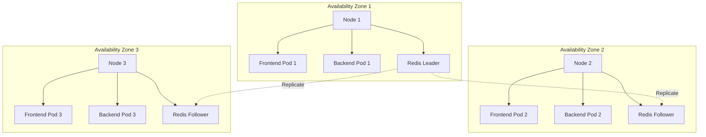

**Pod Anti-Affinity:**

- Pods of the same type are spread across different availability zones
- Prevents single AZ failure from taking down all instances
- Configured via `topologySpreadConstraints`

## Disaster Recovery

### Backup Strategy

| Component            | Backup Method       | Frequency            | Retention       |
| -------------------- | ------------------- | -------------------- | --------------- |
| RDS PostgreSQL       | Automated snapshots | Daily                | 7 days          |
| RDS PostgreSQL       | Manual snapshots    | Before major changes | 30 days         |
| Redis                | RDB snapshots       | Every 5 minutes      | 1 day           |
| Kubernetes manifests | Git repository      | On every commit      | Indefinite      |
| Secrets              | AWS Secrets Manager | Continuous           | Version history |

### Recovery Time Objectives

| Scenario         | RTO          | RPO              | Recovery Procedure                      |
| ---------------- | ------------ | ---------------- | --------------------------------------- |
| Pod failure      | < 1 minute   | 0 (no data loss) | Automatic (Kubernetes)                  |
| Node failure     | < 5 minutes  | 0 (no data loss) | Automatic (Pod rescheduling)            |
| AZ failure       | < 10 minutes | 0 (no data loss) | Automatic (Multi-AZ)                    |
| Database failure | < 30 minutes | < 5 minutes      | Restore from RDS snapshot               |
| Cluster failure  | < 2 hours    | < 1 hour         | Rebuild cluster, restore from Git + RDS |
| Region failure   | < 4 hours    | < 1 hour         | Failover to DR region (manual)          |

### Health Checks

All pods implement:

- **Liveness probe**: Detects crashed/frozen processes (restart pod)
- **Readiness probe**: Detects when pod is ready to serve traffic (add to service endpoints)
- **Startup probe**: Allows slow-starting containers extra time to initialize

```yaml
# Example health checks (Backend)
livenessProbe:
  httpGet:
    path: /health/live
    port: 3000
  initialDelaySeconds: 30
  periodSeconds: 10
  timeoutSeconds: 5
  failureThreshold: 3

readinessProbe:
  httpGet:
    path: /health/ready
    port: 3000
  initialDelaySeconds: 10
  periodSeconds: 5
  timeoutSeconds: 3
  failureThreshold: 3
```

## Configuration Management

### Kustomize Overlays

The system uses Kustomize for environment-specific configuration:

```
k8s/
├── base/                    # Base configuration (shared)
│   ├── backend/
│   ├── frontend/
│   ├── redis/
│   └── kustomization.yaml
└── overlays/
    ├── development/         # Dev-specific overrides
    │   ├── patches/
    │   └── kustomization.yaml
    ├── staging/             # Staging-specific overrides
    │   ├── patches/
    │   └── kustomization.yaml
    └── production/          # Prod-specific overrides
        ├── patches/
        └── kustomization.yaml
```

**Environment Differences:**

- **Development**: Lower resource limits, 1 replica, debug logging enabled
- **Staging**: Production-like resources, 2 replicas, info logging
- **Production**: Full resources, 3+ replicas, warn/error logging, stricter security

### ConfigMaps vs Secrets

| Configuration Type   | Storage                                | Example                                      |
| -------------------- | -------------------------------------- | -------------------------------------------- |
| Non-sensitive config | ConfigMap (in Git)                     | API endpoints, feature flags, timeout values |
| Sensitive config     | External Secrets (AWS Secrets Manager) | DB passwords, JWT keys, API keys             |

## Technology Stack Summary

| Layer              | Technology                | Version |
| ------------------ | ------------------------- | ------- |
| Orchestration      | Kubernetes                | 1.28+   |
| GitOps             | ArgoCD                    | 2.9+    |
| Manifests          | Kustomize                 | 5.0+    |
| Ingress            | NGINX Ingress Controller  | 1.9+    |
| TLS                | cert-manager              | 1.13+   |
| Secrets            | External Secrets Operator | 0.9+    |
| Monitoring         | Prometheus                | 2.47+   |
| Logging            | Loki                      | 2.9+    |
| Dashboards         | Grafana                   | 10.2+   |
| Caching            | Redis                     | 7.2+    |
| Connection Pooling | PgBouncer                 | 1.21+   |
| Database           | PostgreSQL (RDS)          | 15+     |

## References

- [Kubernetes Best Practices](https://kubernetes.io/docs/concepts/configuration/overview/)
- [NGINX Ingress Controller](https://kubernetes.github.io/ingress-nginx/)
- [ArgoCD Documentation](https://argo-cd.readthedocs.io/)
- [Prometheus Operator](https://prometheus-operator.dev/)
- [External Secrets Operator](https://external-secrets.io/)
