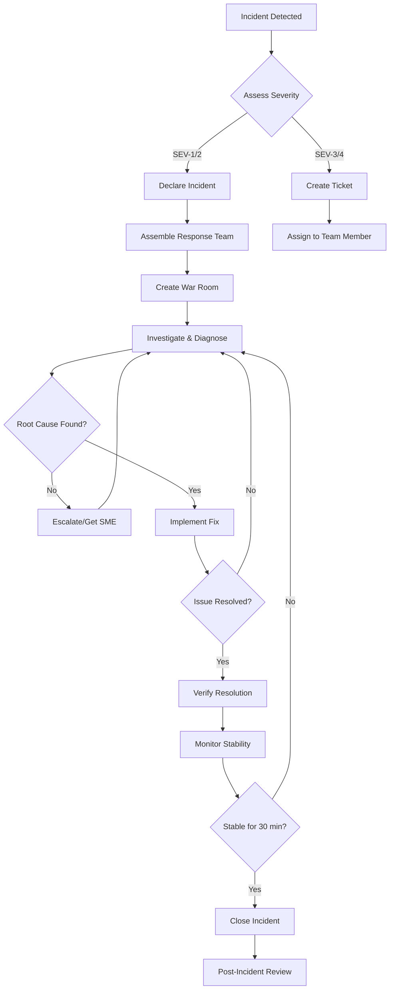

# Runbook: Incident Response

## Overview

This runbook provides the general incident response process for the Hospital ERP System.

**Purpose**: Standardize incident handling to minimize downtime and impact
**Scope**: Production incidents affecting system availability or data integrity
**Related Runbooks**: All operational runbooks

---

## Incident Severity Classification

| Severity           | Definition                                           | Response Time        | Examples                                              |
| ------------------ | ---------------------------------------------------- | -------------------- | ----------------------------------------------------- |
| **SEV-1 Critical** | Complete service outage, data loss                   | Immediate (< 15 min) | Database down, all pods crashing, security breach     |
| **SEV-2 High**     | Major functionality unavailable                      | < 1 hour             | Partial outage, critical API failing, high error rate |
| **SEV-3 Medium**   | Degraded performance, non-critical features affected | < 4 hours            | Slow response times, minor feature broken             |
| **SEV-4 Low**      | Minor issues, no user impact                         | Next business day    | Documentation error, cosmetic bug                     |

---

## Incident Response Roles

### Incident Commander (IC)

- **Responsibility**: Overall incident coordination
- **Duties**:
  - Declare incident severity
  - Coordinate response team
  - Communicate with stakeholders
  - Make final decisions on actions
  - Conduct post-incident review

### Technical Lead (TL)

- **Responsibility**: Technical investigation and resolution
- **Duties**:
  - Lead technical troubleshooting
  - Assign tasks to responders
  - Implement fixes
  - Verify resolution

### Communications Lead (CL)

- **Responsibility**: Stakeholder communication
- **Duties**:
  - Post status updates (internal/external)
  - Notify affected users
  - Update incident page
  - Coordinate with support team

### Subject Matter Expert (SME)

- **Responsibility**: Domain expertise
- **Duties**:
  - Database specialist for DB issues
  - Security expert for security incidents
  - Infrastructure engineer for K8s issues

---

## Incident Response Workflow



---

## Phase 1: Detection & Declaration (0-15 minutes)

### Step 1.1: Incident Detection

**Incident can be detected via**:

- Prometheus/AlertManager alerts
- User reports (support tickets, social media)
- Monitoring dashboard anomalies
- Scheduled health checks

**Immediate Actions**:

```bash
# Check Prometheus alerts
open https://prometheus.hospital-erp.example.com/alerts

# Check Grafana dashboards
open https://grafana.hospital-erp.example.com/d/system-overview

# Verify pod status
kubectl get pods -n hospital-erp-system
kubectl get events -n hospital-erp-system --sort-by='.lastTimestamp' | tail -20
```

---

### Step 1.2: Assess Severity

**Ask these questions**:

1. Are users unable to access the system? → **SEV-1**
2. Is critical functionality (patient records, appointments) broken? → **SEV-1/2**
3. Is performance significantly degraded? → **SEV-2/3**
4. Is data integrity compromised? → **SEV-1**

**Check user impact**:

```promql
# Current error rate
sum(rate(http_requests_total{status=~"5.."}[1m]))
/
sum(rate(http_requests_total[1m]))

# Request rate (compare to normal)
sum(rate(http_requests_total[1m]))
```

---

### Step 1.3: Declare Incident

**For SEV-1/SEV-2 incidents, immediately**:

1. **Create incident in Slack**

```
Channel: #incidents
Message template:
---
🚨 **INCIDENT DECLARED**
**Severity**: SEV-1
**Summary**: Backend service completely down
**Impact**: All users unable to access system
**Detected**: 2026-01-24 14:30 KST
**IC**: @john.doe
**TL**: @jane.smith
**War Room**: #incident-2026-01-24-001
---
```

2. **Create war room channel**

```bash
# Create dedicated Slack channel
/create #incident-2026-01-24-001

# Invite response team
/invite @john.doe @jane.smith @db-team
```

3. **Page on-call team** (SEV-1 only)

```bash
pd-alert --severity critical \
  --service hospital-erp \
  --message "SEV-1: Complete backend outage"
```

4. **Update status page** (if public-facing)

```
Status: Major Outage
Message: "We are experiencing technical difficulties. Our team is investigating."
```

---

## Phase 2: Investigation & Diagnosis (15 min - 2 hours)

### Step 2.1: Gather Initial Information

**Execute these commands in parallel**:

```bash
# Terminal 1: Pod status
kubectl get pods -n hospital-erp-system -w

# Terminal 2: Recent events
kubectl get events -n hospital-erp-system --sort-by='.lastTimestamp' | tail -50

# Terminal 3: Backend logs
kubectl logs -n hospital-erp-system -l app=backend --tail=100 -f

# Terminal 4: Prometheus metrics
kubectl port-forward -n monitoring svc/prometheus-operated 9090:9090
```

**Document findings in war room**:

```
**Initial Findings**:
- All 3 backend pods in CrashLoopBackOff
- Error in logs: "Cannot connect to database"
- PgBouncer pods: 2/2 Running
- RDS status: Available (AWS console)
```

---

### Step 2.2: Identify Root Cause

**Use relevant runbook**:
| Symptom | Runbook |
|---------|---------|
| High error rate | [High Error Rate](./high-error-rate.md) |
| Slow response time | [High Response Time](./high-response-time.md) |
| Pods crashing | [Pod Crash Looping](./pod-crash-looping.md) |
| Database errors | [Database Connection Issues](./database-connection-issues.md) |

**Common Investigation Steps**:

1. Check recent deployments (last 24 hours)
2. Review configuration changes
3. Analyze logs for error patterns
4. Check external dependencies (RDS, Redis)
5. Verify network connectivity

**Document hypothesis**:

```
**Hypothesis**: Recent deployment (v1.2.3) introduced database connection pool leak
**Evidence**:
- Deployment timestamp: 14:15 KST (15 min before incident)
- Logs show increasing connection count
- PgBouncer pool exhausted
```

---

### Step 2.3: Determine Immediate Actions

**Prioritize**:

1. **Stop the bleeding**: Prevent further damage
2. **Restore service**: Get users back online
3. **Fix root cause**: Permanent solution (can be deferred)

**Decision tree**:

```
Can we rollback safely?
├─ YES → Rollback deployment (fastest recovery)
└─ NO → Apply hotfix or workaround

Is data integrity at risk?
├─ YES → Take system offline, fix data, then restore
└─ NO → Fix while maintaining partial service
```

---

## Phase 3: Resolution (Varies by incident)

### Step 3.1: Implement Fix

**Example: Rollback deployment**

```bash
# Rollback backend to previous version
kubectl rollout undo deployment/backend -n hospital-erp-system

# Monitor rollback
kubectl rollout status deployment/backend -n hospital-erp-system

# Verify pods are healthy
kubectl get pods -n hospital-erp-system -l app=backend
```

**Update war room**:

```
**14:45 KST - Action Taken**
Rolled back backend deployment to v1.2.2
Pods are coming up healthy
```

---

### Step 3.2: Verify Resolution

**Run verification checks**:

```bash
# 1. Check pod status
kubectl get pods -n hospital-erp-system
# Expected: All "Running", 0 restarts

# 2. Test API endpoint
curl -I https://api.hospital-erp.example.com/health
# Expected: 200 OK

# 3. Check error rate
# Prometheus query:
sum(rate(http_requests_total{status=~"5.."}[1m])) / sum(rate(http_requests_total[1m]))
# Expected: < 0.01 (1%)

# 4. Verify response time
# Expected: P95 < 1s

# 5. User acceptance test
# Have support team verify key workflows
```

**Checklist**:

- [ ] All pods healthy and running
- [ ] API health check passing
- [ ] Error rate < 1%
- [ ] Response time normal
- [ ] Database connections normal
- [ ] No new alerts firing
- [ ] User-facing functionality verified

---

### Step 3.3: Monitor Stability Period

**Monitor for 30 minutes minimum**:

```bash
# Watch pod status
kubectl get pods -n hospital-erp-system -w

# Monitor metrics in Grafana
open https://grafana.hospital-erp.example.com/d/system-overview

# Check for new errors
kubectl logs -n hospital-erp-system -l app=backend -f | grep -i error
```

**If issue recurs during stability period**:

- Return to Phase 2 (Investigation)
- Consider more aggressive fix (e.g., service offline for data repair)

---

## Phase 4: Communication

### During Incident

**Update frequency**:
| Severity | Update Interval | Channels |
|----------|----------------|----------|
| **SEV-1** | Every 15 minutes | Slack, Status Page, Email |
| **SEV-2** | Every 30 minutes | Slack, Status Page |
| **SEV-3** | Every 1 hour | Slack |
| **SEV-4** | Once at close | Slack |

**Update template**:

```
**14:45 KST - Update #3**
**Status**: Investigating
**Summary**: Rollback completed, pods starting up
**Next Update**: 15:00 KST
**Impact**: Users still experiencing errors, expect resolution in 10 min
```

---

### External Communication

**For user-facing incidents (SEV-1/2)**:

1. **Initial notification** (within 15 minutes)

```
Subject: Service Issue - Hospital ERP System

We are currently experiencing technical difficulties with the Hospital ERP System.
Our engineering team is actively investigating and working to restore service.

Current Status: Investigating
Estimated Resolution: TBD (next update in 30 minutes)

We apologize for the inconvenience.
```

2. **Resolution notification**

```
Subject: Service Restored - Hospital ERP System

The issue affecting the Hospital ERP System has been resolved.
Service has been fully restored as of 15:00 KST.

Root Cause: Database connection pool exhaustion
Resolution: Reverted recent deployment

We apologize for the disruption and appreciate your patience.
```

---

## Phase 5: Incident Closure

### Step 5.1: Confirm Resolution

**Final verification**:

- [ ] Incident severity criteria no longer met
- [ ] System stable for 30+ minutes
- [ ] All alerts resolved
- [ ] User acceptance confirmed
- [ ] No recurring issues

**Close incident in war room**:

```
**15:30 KST - INCIDENT RESOLVED**
**Duration**: 1 hour
**Root Cause**: Database connection pool leak in v1.2.3
**Resolution**: Rolled back to v1.2.2
**Follow-up Actions**: See post-incident review
```

---

### Step 5.2: Document Timeline

**Create incident timeline**:

```markdown
## Incident Timeline: 2026-01-24-001

| Time (KST) | Event                                          |
| ---------- | ---------------------------------------------- |
| 14:30      | Prometheus alert: HighErrorRate firing         |
| 14:32      | Incident declared SEV-1                        |
| 14:35      | War room created, response team assembled      |
| 14:40      | Root cause identified: DB connection pool leak |
| 14:45      | Rollback initiated                             |
| 14:50      | Pods healthy, error rate dropping              |
| 15:00      | Service restored, monitoring stability         |
| 15:30      | Incident closed, stable for 30 min             |
```

---

## Phase 6: Post-Incident Review (Within 48 hours)

### Step 6.1: Schedule Post-Mortem

**Attendees**:

- Incident Commander
- Technical Lead
- Engineering Manager
- Product Manager (if user-facing impact)
- Anyone involved in response

**Agenda**:

1. Timeline review
2. What went well
3. What went poorly
4. Root cause analysis (5 Whys)
5. Action items

---

### Step 6.2: Write Post-Incident Report

**Template**:

```markdown
# Post-Incident Review: 2026-01-24-001

## Summary

- **Date**: 2026-01-24
- **Duration**: 1 hour (14:30 - 15:30 KST)
- **Severity**: SEV-1
- **Impact**: Complete backend outage, 100% of users affected

## Timeline

[See incident timeline above]

## Root Cause

Deployment v1.2.3 introduced a database connection pool leak where
connections were acquired but not properly released after query timeout.
This exhausted the PgBouncer connection pool within 15 minutes of deployment.

## 5 Whys Analysis

1. Why did the backend fail? → Database connections exhausted
2. Why were connections exhausted? → Connection pool leak
3. Why was there a leak? → Timeout error handler didn't release connection
4. Why didn't we catch this? → Integration tests didn't test timeout scenarios
5. Why didn't we have timeout tests? → Incomplete test coverage requirements

## What Went Well

- Fast detection (2 minutes from error to alert)
- Quick incident declaration
- Effective communication in war room
- Rollback executed smoothly

## What Went Poorly

- Deployment went to production without load testing
- Integration tests didn't cover connection leak scenarios
- No automated rollback on high error rate

## Action Items

| Action                                              | Owner        | Due Date   | Priority |
| --------------------------------------------------- | ------------ | ---------- | -------- |
| Add integration test for connection pool exhaustion | Backend Team | 2026-01-26 | High     |
| Implement automatic rollback on error rate > 5%     | DevOps       | 2026-01-27 | High     |
| Add load testing to CI/CD pipeline                  | QA Team      | 2026-01-31 | Medium   |
| Document connection pool best practices             | Backend Team | 2026-01-28 | Medium   |
| Set up PgBouncer connection alerts                  | DevOps       | 2026-01-25 | High     |

## Lessons Learned

- Connection pool leaks can cause rapid outages
- Load testing before production is critical
- Automatic rollback would have reduced downtime by 50%
```

---

### Step 6.3: Track Action Items

**Create GitHub issues for each action**:

```bash
gh issue create --repo kcenon/hospital_erp_system \
  --title "[Post-Incident] Add integration test for connection pool" \
  --label "type:task" \
  --label "priority:high" \
  --body "From incident 2026-01-24-001: Add test to verify connections are released on timeout"
```

**Review in weekly team meeting until complete**.

---

## Incident Metrics

### Track These Metrics

| Metric                                | Target           | Purpose                   |
| ------------------------------------- | ---------------- | ------------------------- |
| **MTTD** (Mean Time to Detect)        | < 5 min          | How fast we notice issues |
| **MTTACK** (Mean Time to Acknowledge) | < 15 min         | How fast we respond       |
| **MTTR** (Mean Time to Resolve)       | < 1 hour (SEV-1) | How fast we fix           |
| **Incident Count**                    | Decreasing trend | Are we improving?         |
| **Repeat Incidents**                  | 0                | Did we fix root cause?    |

**Monthly Incident Review**:

- Analyze trends
- Identify systemic issues
- Prioritize prevention work

---

## Escalation Paths

### Technical Escalation

```
Level 1: On-call Engineer
    ↓ (if unresolved after 30 min)
Level 2: Engineering Team Lead
    ↓ (if unresolved after 1 hour)
Level 3: Engineering Manager
    ↓ (if unresolved after 2 hours or SEV-1)
Level 4: VP Engineering / CTO
```

### Business Escalation

**For user-facing SEV-1 incidents**:

- Notify: Product Manager (immediately)
- Notify: Customer Support Lead (immediately)
- Notify: VP Product (after 30 min)
- Notify: CEO (if > 2 hour outage)

---

## Incident Response Tools

### Required Access

- [ ] kubectl access to production cluster
- [ ] AWS Console access
- [ ] Grafana/Prometheus access
- [ ] PagerDuty account
- [ ] Slack admin for creating channels
- [ ] GitHub write access

### Useful Commands

```bash
# Quick cluster overview
kubectl get pods -A | grep -v Running

# Recent events across all namespaces
kubectl get events --all-namespaces --sort-by='.lastTimestamp' | tail -50

# Resource usage
kubectl top nodes
kubectl top pods -A --sort-by=memory

# Describe failing pod
kubectl describe pod <POD> -n <NAMESPACE>

# Port-forward to Prometheus
kubectl port-forward -n monitoring svc/prometheus-operated 9090:9090

# Emergency: Delete all pods (forces recreation)
kubectl delete pods -n hospital-erp-system --all
```

---

## Templates

### Slack Incident Declaration

```
🚨 **INCIDENT DECLARED**
**Severity**: SEV-[1/2/3]
**Summary**: [One-line description]
**Impact**: [User impact]
**Detected**: [Timestamp]
**IC**: @[username]
**TL**: @[username]
**War Room**: #incident-[date]-[number]
```

### Status Page Update

```
**Title**: [Brief description]
**Status**: [Investigating / Identified / Monitoring / Resolved]
**Message**: [Detailed explanation for users]
**Updated**: [Timestamp]
```

---

## Related Documentation

- [High Error Rate Runbook](./high-error-rate.md)
- [High Response Time Runbook](./high-response-time.md)
- [Pod Crash Looping Runbook](./pod-crash-looping.md)
- [Database Connection Issues Runbook](./database-connection-issues.md)
- [Scaling Procedures](./scaling-procedures.md)
- [Architecture Overview](../architecture.md)

---

## Revision History

| Version | Date       | Author      | Changes         |
| ------- | ---------- | ----------- | --------------- |
| 1.0     | 2026-01-24 | DevOps Team | Initial version |
