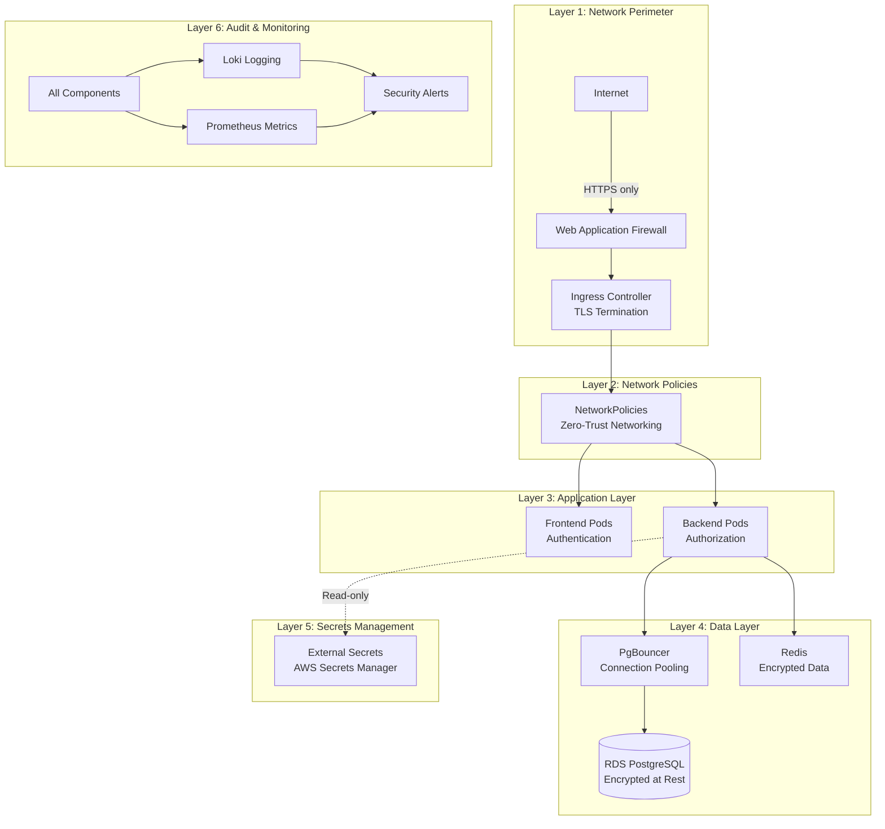
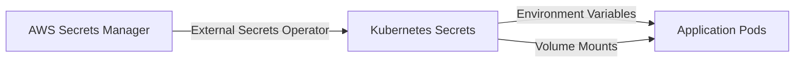

# Security Documentation

## Overview

This document describes the security measures implemented in the Hospital ERP System Kubernetes deployment, including network policies, RBAC configuration, secrets management, and compliance considerations.

## Table of Contents

1. [Security Architecture](#security-architecture)
2. [Network Security](#network-security)
3. [Access Control (RBAC)](#access-control-rbac)
4. [Secrets Management](#secrets-management)
5. [Pod Security](#pod-security)
6. [TLS/SSL Configuration](#tlsssl-configuration)
7. [Compliance (HIPAA)](#compliance-hipaa)
8. [Security Monitoring](#security-monitoring)
9. [Security Best Practices](#security-best-practices)

## Security Architecture

### Defense in Depth

The system implements multiple layers of security:



### Security Principles

| Principle                    | Implementation                                                  |
| ---------------------------- | --------------------------------------------------------------- |
| **Least Privilege**          | RBAC with minimal permissions, service accounts per component   |
| **Zero Trust**               | Default-deny network policies, explicit allow rules             |
| **Defense in Depth**         | Multiple security layers (WAF, ingress, network policies, RBAC) |
| **Encryption Everywhere**    | TLS in transit, encryption at rest for data                     |
| **Audit Everything**         | Comprehensive logging and monitoring                            |
| **Immutable Infrastructure** | GitOps deployment, container images are immutable               |

## Network Security

### Network Policies

The system uses Kubernetes NetworkPolicies to implement zero-trust networking.

#### 1. Default Deny Policy

All traffic is denied by default:

```yaml
# k8s/base/network-policies/default-deny.yaml
apiVersion: networking.k8s.io/v1
kind: NetworkPolicy
metadata:
  name: default-deny-all
spec:
  podSelector: {}
  policyTypes:
    - Ingress
    - Egress
```

**Effect**: No pod can communicate unless explicitly allowed by other NetworkPolicies.

#### 2. Backend Network Policy

```yaml
# k8s/base/network-policies/backend-policy.yaml
spec:
  podSelector:
    matchLabels:
      app.kubernetes.io/name: backend
  ingress:
    - from:
        - namespaceSelector:
            matchLabels:
              kubernetes.io/metadata.name: ingress-nginx
      ports:
        - protocol: TCP
          port: 3000
    - from:
        - podSelector:
            matchLabels:
              app.kubernetes.io/name: frontend
      ports:
        - protocol: TCP
          port: 3000
  egress:
    - to:
        - podSelector:
            matchLabels:
              app.kubernetes.io/name: pgbouncer
      ports:
        - protocol: TCP
          port: 6432
    - to:
        - podSelector:
            matchLabels:
              app.kubernetes.io/name: redis
      ports:
        - protocol: TCP
          port: 6379
```

**Allowed Traffic**:

- **Ingress**: From ingress controller and frontend pods on port 3000
- **Egress**: To PgBouncer (port 6432) and Redis (port 6379)

#### 3. Frontend Network Policy

```yaml
# k8s/base/network-policies/frontend-policy.yaml
spec:
  podSelector:
    matchLabels:
      app.kubernetes.io/name: frontend
  ingress:
    - from:
        - namespaceSelector:
            matchLabels:
              kubernetes.io/metadata.name: ingress-nginx
      ports:
        - protocol: TCP
          port: 3000
  egress:
    - to:
        - podSelector:
            matchLabels:
              app.kubernetes.io/name: backend
      ports:
        - protocol: TCP
          port: 3000
```

**Allowed Traffic**:

- **Ingress**: From ingress controller on port 3000
- **Egress**: To backend pods on port 3000

#### 4. Database Network Policy

```yaml
# k8s/base/network-policies/database-policy.yaml
spec:
  podSelector:
    matchLabels:
      app.kubernetes.io/name: pgbouncer
  ingress:
    - from:
        - podSelector:
            matchLabels:
              app.kubernetes.io/name: backend
      ports:
        - protocol: TCP
          port: 6432
  egress:
    - to:
        - podSelector: {}
      ports:
        - protocol: TCP
          port: 5432
```

**Allowed Traffic**:

- **Ingress**: From backend pods on port 6432
- **Egress**: To PostgreSQL (RDS) on port 5432

#### 5. Redis Network Policy

```yaml
# k8s/base/network-policies/redis-policy.yaml
spec:
  podSelector:
    matchLabels:
      app.kubernetes.io/name: redis
  ingress:
    - from:
        - podSelector:
            matchLabels:
              app.kubernetes.io/name: backend
      ports:
        - protocol: TCP
          port: 6379
  egress: []
```

**Allowed Traffic**:

- **Ingress**: From backend pods on port 6379
- **Egress**: None (Redis doesn't need outbound connections)

#### 6. DNS Policy

```yaml
# k8s/base/network-policies/allow-dns.yaml
spec:
  podSelector: {}
  egress:
    - to:
        - namespaceSelector:
            matchLabels:
              kubernetes.io/metadata.name: kube-system
        - podSelector:
            matchLabels:
              k8s-app: kube-dns
      ports:
        - protocol: UDP
          port: 53
```

**Effect**: All pods can perform DNS queries to CoreDNS.

### Verifying Network Policies

```bash
# List all network policies
kubectl get networkpolicy -n hospital-erp-system

# Check specific policy
kubectl describe networkpolicy backend-network-policy -n hospital-erp-system

# Test connectivity (should fail if policy is working)
kubectl run -it --rm test --image=nicolaka/netshoot --restart=Never -n hospital-erp-system -- \
  curl http://backend-service:3000/health

# Test from allowed namespace
kubectl run -it --rm test --image=nicolaka/netshoot --restart=Never -n ingress-nginx -- \
  curl http://backend-service.hospital-erp-system:3000/health
```

### Network Security Best Practices

1. **Default Deny**: Always start with default deny policy
2. **Explicit Allow**: Only allow necessary traffic
3. **Namespace Isolation**: Use namespace selectors for cross-namespace traffic
4. **Port Specificity**: Specify exact ports, not port ranges
5. **Label-Based Selection**: Use consistent labels for pod selection
6. **Testing**: Always test network policies before production

## Access Control (RBAC)

### Service Accounts

Each component has its own service account:

```yaml
# k8s/base/rbac/service-accounts.yaml
apiVersion: v1
kind: ServiceAccount
metadata:
  name: backend-sa
  labels:
    app.kubernetes.io/name: backend
---
apiVersion: v1
kind: ServiceAccount
metadata:
  name: frontend-sa
  labels:
    app.kubernetes.io/name: frontend
```

### Backend RBAC

```yaml
# k8s/base/rbac/backend-role.yaml
apiVersion: rbac.authorization.k8s.io/v1
kind: Role
metadata:
  name: backend-role
rules:
  - apiGroups: ['']
    resources: ['configmaps']
    verbs: ['get', 'list', 'watch']
  - apiGroups: ['']
    resources: ['secrets']
    resourceNames: ['backend-secrets', 'database-credentials', 'redis-credentials']
    verbs: ['get', 'watch']
  - apiGroups: ['']
    resources: ['pods']
    verbs: ['get', 'list']
```

**Permissions**:

- **ConfigMaps**: Read-only access to all ConfigMaps
- **Secrets**: Read-only access to specific secrets only
- **Pods**: List pods (for health checks)

```yaml
# k8s/base/rbac/role-bindings.yaml
apiVersion: rbac.authorization.k8s.io/v1
kind: RoleBinding
metadata:
  name: backend-rolebinding
roleRef:
  apiGroup: rbac.authorization.k8s.io
  kind: Role
  name: backend-role
subjects:
  - kind: ServiceAccount
    name: backend-sa
```

### Frontend RBAC

```yaml
# k8s/base/rbac/frontend-role.yaml
apiVersion: rbac.authorization.k8s.io/v1
kind: Role
metadata:
  name: frontend-role
rules:
  - apiGroups: ['']
    resources: ['configmaps']
    verbs: ['get', 'list']
```

**Permissions**:

- **ConfigMaps**: Read-only access to ConfigMaps (for runtime configuration)

### Verifying RBAC

```bash
# Check service accounts
kubectl get serviceaccounts -n hospital-erp-system

# Check roles
kubectl get roles -n hospital-erp-system

# Check role bindings
kubectl get rolebindings -n hospital-erp-system

# Test permissions
kubectl auth can-i get secrets --as=system:serviceaccount:hospital-erp-system:backend-sa -n hospital-erp-system

# Test specific secret access
kubectl auth can-i get secrets/backend-secrets --as=system:serviceaccount:hospital-erp-system:backend-sa -n hospital-erp-system
```

### RBAC Best Practices

1. **Minimal Permissions**: Grant only necessary permissions
2. **Named Secrets**: Restrict secret access to specific secret names
3. **No Wildcard Permissions**: Avoid `verbs: ['*']`
4. **Service Account per Component**: Don't reuse service accounts
5. **Regular Audits**: Review RBAC permissions regularly

## Secrets Management

### External Secrets Operator

Secrets are stored in **AWS Secrets Manager** and synchronized to Kubernetes using External Secrets Operator.



#### Secret Structure in AWS Secrets Manager

```json
{
  "hospital-erp/production/database": {
    "username": "hospitaladmin",
    "password": "<strong-password>",
    "host": "hospital-erp-db.us-east-1.rds.amazonaws.com",
    "port": "5432",
    "database": "hospital_erp"
  },
  "hospital-erp/production/redis": {
    "password": "<redis-password>"
  },
  "hospital-erp/production/jwt": {
    "secret": "<64-char-random-string>",
    "refresh-secret": "<64-char-random-string>"
  },
  "hospital-erp/production/encryption": {
    "key": "<32-char-encryption-key>"
  }
}
```

#### ExternalSecret Resource

```yaml
apiVersion: external-secrets.io/v1beta1
kind: ExternalSecret
metadata:
  name: backend-secrets
spec:
  refreshInterval: 1h
  secretStoreRef:
    name: aws-secrets-manager
    kind: SecretStore
  target:
    name: backend-secrets
    creationPolicy: Owner
  data:
    - secretKey: DATABASE_USER
      remoteRef:
        key: hospital-erp/production/database
        property: username
    - secretKey: DATABASE_PASSWORD
      remoteRef:
        key: hospital-erp/production/database
        property: password
    - secretKey: JWT_SECRET
      remoteRef:
        key: hospital-erp/production/jwt
        property: secret
```

### Secret Rotation

Secrets are rotated automatically:

```bash
# Rotate database password (AWS RDS)
aws rds modify-db-instance \
  --db-instance-identifier hospital-erp-production \
  --master-user-password <new-password>

# Update AWS Secrets Manager
aws secretsmanager update-secret \
  --secret-id hospital-erp/production/database \
  --secret-string '{"username":"hospitaladmin","password":"<new-password>",...}'

# External Secrets Operator will automatically sync new secret

# Restart pods to pick up new secret (if needed)
kubectl rollout restart deployment/backend -n hospital-erp-system
```

### Secrets Best Practices

1. **External Storage**: Never commit secrets to Git
2. **Encryption at Rest**: Use AWS KMS to encrypt secrets
3. **Access Control**: Use IAM policies to restrict secret access
4. **Rotation**: Rotate secrets regularly (quarterly)
5. **Audit Logging**: Enable AWS CloudTrail for secret access logs
6. **Named Secrets**: RBAC permissions should specify exact secret names

## Pod Security

### Pod Security Standards

The namespace enforces **restricted** Pod Security Standard:

```yaml
# k8s/base/namespace.yaml
apiVersion: v1
kind: Namespace
metadata:
  name: hospital-erp-system
  labels:
    pod-security.kubernetes.io/enforce: restricted
    pod-security.kubernetes.io/enforce-version: latest
```

**Restricted standard enforces**:

- No privileged containers
- No host namespaces (PID, IPC, network)
- No host ports
- No HostPath volumes
- Containers must run as non-root
- Read-only root filesystem (where possible)
- Limited capabilities

### Security Context

All pods run with security context:

```yaml
securityContext:
  runAsNonRoot: true
  runAsUser: 1000
  fsGroup: 1000
  seccompProfile:
    type: RuntimeDefault
  capabilities:
    drop:
      - ALL
```

**Settings**:

- **runAsNonRoot**: Container must not run as root
- **runAsUser**: Run as UID 1000
- **fsGroup**: File system group ID 1000
- **seccompProfile**: Use default seccomp profile
- **capabilities**: Drop all Linux capabilities

### Container Security

```yaml
containerSecurityContext:
  allowPrivilegeEscalation: false
  readOnlyRootFilesystem: true
  capabilities:
    drop:
      - ALL
```

**Settings**:

- **allowPrivilegeEscalation**: Prevent privilege escalation
- **readOnlyRootFilesystem**: Root filesystem is read-only (write to volumes only)
- **capabilities**: Drop all capabilities

### Verifying Pod Security

```bash
# Check pod security context
kubectl get pod <pod-name> -n hospital-erp-system -o jsonpath='{.spec.securityContext}'

# Check container security context
kubectl get pod <pod-name> -n hospital-erp-system -o jsonpath='{.spec.containers[0].securityContext}'

# Verify pod is running as non-root
kubectl exec <pod-name> -n hospital-erp-system -- id
# Output should show uid=1000, not uid=0 (root)
```

## TLS/SSL Configuration

### Ingress TLS

HTTPS is enforced for all external traffic:

```yaml
# k8s/base/ingress/ingress.yaml
spec:
  tls:
    - hosts:
        - hospital-erp.example.com
        - api.hospital-erp.example.com
      secretName: hospital-erp-tls
  rules:
    - host: hospital-erp.example.com
      http:
        paths:
          - path: /
            pathType: Prefix
            backend:
              service:
                name: frontend-service
                port:
                  number: 80
```

### cert-manager for Automated TLS

cert-manager automatically provisions and renews TLS certificates:

```yaml
# k8s/base/ingress/certificate.yaml
apiVersion: cert-manager.io/v1
kind: Certificate
metadata:
  name: hospital-erp-tls
spec:
  secretName: hospital-erp-tls
  issuerRef:
    name: letsencrypt-prod
    kind: ClusterIssuer
  dnsNames:
    - hospital-erp.example.com
    - api.hospital-erp.example.com
```

```yaml
# k8s/base/ingress/cluster-issuer.yaml
apiVersion: cert-manager.io/v1
kind: ClusterIssuer
metadata:
  name: letsencrypt-prod
spec:
  acme:
    server: https://acme-v02.api.letsencrypt.org/directory
    email: admin@hospital-erp.example.com
    privateKeySecretRef:
      name: letsencrypt-prod
    solvers:
      - http01:
          ingress:
            class: nginx
```

### Certificate Verification

```bash
# Check certificate status
kubectl get certificate -n hospital-erp-system

# View certificate details
kubectl describe certificate hospital-erp-tls -n hospital-erp-system

# Check TLS secret
kubectl get secret hospital-erp-tls -n hospital-erp-system -o yaml

# Verify HTTPS
curl -I https://hospital-erp.example.com
# Should return 200 OK with valid certificate

# Test certificate expiration
openssl s_client -connect hospital-erp.example.com:443 -servername hospital-erp.example.com < /dev/null 2>/dev/null | openssl x509 -noout -dates
```

## Compliance (HIPAA)

The Hospital ERP System implements HIPAA-compliant security measures:

### HIPAA Requirements Mapping

| HIPAA Requirement                                 | Implementation                          |
| ------------------------------------------------- | --------------------------------------- |
| **Access Control** (164.312(a)(1))                | RBAC, least privilege, service accounts |
| **Audit Controls** (164.312(b))                   | Comprehensive logging with Loki         |
| **Integrity** (164.312(c)(1))                     | Immutable infrastructure, GitOps        |
| **Person or Entity Authentication** (164.312(d))  | JWT authentication, TLS client certs    |
| **Transmission Security** (164.312(e)(1))         | TLS everywhere, encrypted at rest       |
| **Encryption and Decryption** (164.312(a)(2)(iv)) | RDS encryption, TLS in transit          |
| **Emergency Access** (164.312(a)(2)(ii))          | Break-glass procedures documented       |

### PHI Data Protection

**Protected Health Information (PHI)** is encrypted:

- **In Transit**: TLS 1.2+ for all communication
- **At Rest**: AWS RDS encryption with KMS
- **In Memory**: Sensitive data cleared after use
- **In Logs**: PHI is redacted or masked in logs

### Audit Logging

All access to PHI is logged:

```bash
# View audit logs
kubectl logs -l app=backend -n hospital-erp-system | grep "AUDIT"

# Query logs in Loki
kubectl port-forward svc/grafana -n monitoring 3000:3000
# Open Grafana and query: {namespace="hospital-erp-system"} |= "AUDIT"
```

### Data Retention

- **Logs**: Retained for 6 years (HIPAA requirement)
- **Database Backups**: Retained for 7 years
- **Audit Logs**: Retained for 6 years in S3 Glacier

## Security Monitoring

### Security Metrics

Prometheus collects security-related metrics:

```promql
# Failed authentication attempts
rate(http_requests_total{status="401"}[5m])

# Authorization failures
rate(http_requests_total{status="403"}[5m])

# TLS certificate expiration
probe_ssl_earliest_cert_expiry - time()
```

### Security Alerts

```yaml
# Prometheus AlertingRule
- alert: HighAuthenticationFailureRate
  expr: rate(http_requests_total{status="401"}[5m]) > 10
  for: 5m
  labels:
    severity: warning
  annotations:
    summary: High authentication failure rate

- alert: CertificateExpiringSoon
  expr: (probe_ssl_earliest_cert_expiry - time()) < 7*24*3600
  for: 1h
  labels:
    severity: warning
  annotations:
    summary: TLS certificate expiring in less than 7 days
```

### Intrusion Detection

```bash
# Check for suspicious pod activity
kubectl get pods -n hospital-erp-system -o jsonpath='{.items[*].spec.containers[*].securityContext.privileged}'
# Should return false or empty

# Check for privilege escalation attempts
kubectl logs -l app=backend -n hospital-erp-system | grep -i "privilege\|escalation"

# Check for unauthorized network connections
kubectl exec deployment/backend -n hospital-erp-system -- netstat -tulpn
```

## Security Best Practices

### Deployment Security

1. **Immutable Images**: Never update images in-place, always deploy new versions
2. **Image Scanning**: Scan container images for vulnerabilities (Trivy, Snyk)
3. **Signed Images**: Use Cosign to sign and verify container images
4. **No Latest Tag**: Always use specific version tags, never `latest`

```bash
# Scan image for vulnerabilities
trivy image hospital-erp/backend:1.2.3

# Sign image with Cosign
cosign sign hospital-erp/backend:1.2.3

# Verify signature
cosign verify hospital-erp/backend:1.2.3
```

### Runtime Security

1. **Resource Limits**: Always set CPU/memory limits
2. **Health Checks**: Configure liveness and readiness probes
3. **Graceful Shutdown**: Handle SIGTERM for graceful pod shutdown
4. **No Shell Access**: Disable `kubectl exec` in production (if possible)

### Incident Response

1. **Isolate**: Use NetworkPolicies to isolate compromised pods
2. **Preserve**: Capture logs and state before deleting pods
3. **Rotate**: Rotate all secrets if compromise suspected
4. **Review**: Conduct post-incident security review

## Security Checklist

### Pre-Deployment Security

- [ ] All images scanned for vulnerabilities
- [ ] NetworkPolicies tested and verified
- [ ] RBAC configured with least privilege
- [ ] Secrets stored in AWS Secrets Manager (not Git)
- [ ] Pod Security Standards enforced
- [ ] TLS certificates configured
- [ ] Security context defined for all containers
- [ ] Resource limits set for all containers

### Post-Deployment Security

- [ ] Verify HTTPS is enforced
- [ ] Test NetworkPolicies (deny by default)
- [ ] Verify RBAC permissions
- [ ] Check secrets are syncing from AWS
- [ ] Verify pods running as non-root
- [ ] Test authentication and authorization
- [ ] Enable security monitoring alerts
- [ ] Review audit logs

### Ongoing Security

- [ ] Monthly security scans
- [ ] Quarterly secret rotation
- [ ] Semi-annual penetration testing
- [ ] Annual security audit
- [ ] Regular RBAC permission review
- [ ] Update TLS certificates before expiration

## References

- [Kubernetes Security Best Practices](https://kubernetes.io/docs/concepts/security/security-checklist/)
- [HIPAA Security Rule](https://www.hhs.gov/hipaa/for-professionals/security/index.html)
- [OWASP Top 10](https://owasp.org/www-project-top-ten/)
- [CIS Kubernetes Benchmark](https://www.cisecurity.org/benchmark/kubernetes)
- [Pod Security Standards](https://kubernetes.io/docs/concepts/security/pod-security-standards/)

## Revision History

| Version | Date       | Changes                        | Author        |
| ------- | ---------- | ------------------------------ | ------------- |
| 1.0     | 2026-01-24 | Initial security documentation | Platform Team |
